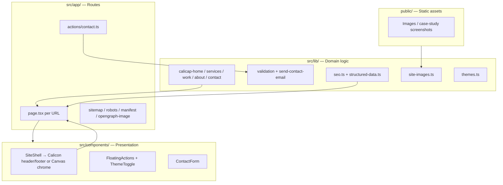

# Calicon Website Architecture

**Purpose:** How this marketing site is built. Copy, case studies, and photography stay in data modules and `public/`; routes compose them; themes only change chrome.

---

## 1. Design philosophy

| Principle | What it means here |
|-----------|-------------------|
| **Separation of concerns** | Routes orchestrate; components render; `src/lib/` holds copy, SEO, contact, and theme config |
| **Content outside JSX** | Narrative copy lives in `src/lib/calicap-*.ts`; images in `src/lib/site-images.ts` and `public/` |
| **Server-first** | Pages are React Server Components; `"use client"` only for theme, nav, forms, and canvas chrome |
| **Static where possible** | App Router static generation; no CMS or database in v1 |
| **SEO as infrastructure** | `seo.ts`, `structured-data.ts`, sitemap, robots, manifest, OG image, JSON-LD |
| **Two skins, one content tree** | Calicon (light agency) and Canvas (dark editorial) read the same pages |

**Not in v1:** filesystem catalog loaders (`specs.txt`), Framer Motion, BottomNav, or a third theme.

---

## 2. Technology stack

```
Framework:     Next.js 15 (App Router)
UI:            React 19 + TypeScript
Styling:       Tailwind CSS v4 + CSS variables per data-theme
Icons:         lucide-react
Forms/email:   Server Actions → validation → Resend HTTP API (console fallback)
Content:       Typed TS modules; MDX enabled for case-study layouts
Deploy:        Vercel (or any Next.js host)
```

---

## 3. High-level architecture



---

## 4. Folder structure

```
project-root/
├── public/
│   └── images/                 # Hero banner, case-study screenshots
├── src/
│   ├── app/
│   │   ├── layout.tsx          # Fonts, rootMetadata, theme boot script, JSON-LD
│   │   ├── page.tsx            # Home
│   │   ├── about/page.tsx
│   │   ├── services/page.tsx
│   │   ├── services/web-app-development/page.tsx
│   │   ├── services/mobile-app-development/page.tsx
│   │   ├── work/page.tsx
│   │   ├── work/calicap-india/page.tsx
│   │   ├── work/retail-growth/  # MDX case study + layout
│   │   ├── work/saas-launch/
│   │   ├── contact/page.tsx
│   │   ├── privacy/
│   │   ├── actions/contact.ts
│   │   ├── sitemap.ts
│   │   ├── robots.ts
│   │   ├── manifest.ts
│   │   └── opengraph-image.tsx
│   ├── components/
│   │   ├── site-shell.tsx      # Theme fork
│   │   ├── site-header.tsx / site-footer.tsx / mobile-nav.tsx
│   │   ├── canvas/             # Canvas rail, menu, home, footer
│   │   ├── floating-actions.tsx
│   │   ├── theme-toggle.tsx
│   │   ├── theme-provider.tsx
│   │   ├── contact-form.tsx
│   │   ├── JsonLd.tsx
│   │   └── button-link.tsx
│   └── lib/
│       ├── calicap-home.ts
│       ├── calicap-services.ts
│       ├── calicap-work.ts
│       ├── calicap-about.ts
│       ├── calicap-contact.ts
│       ├── site-images.ts
│       ├── seo.ts
│       ├── structured-data.ts
│       ├── contact-form-validation.ts
│       ├── send-contact-email.ts
│       └── themes.ts
├── .env.example
└── next.config.ts
```

**Rule:** UI → `components/`. Data, URLs, SEO, email → `lib/`. URLs → `app/`. Browser files → `public/`.

---

## 5. Routing

| Route | Role |
|-------|------|
| `/` | Home (Calicon: full marketing page; Canvas: `CanvasHome` hero, then inner pages share the same tree) |
| `/about` | Practice narrative |
| `/services` | Two pillars |
| `/services/web-app-development` | Web service detail |
| `/services/mobile-app-development` | Mobile service detail |
| `/work` | Case-study index from `calicap-work.ts` |
| `/work/calicap-india` | Dedicated TSX case study |
| `/work/retail-growth`, `/work/saas-launch` | MDX case studies |
| `/contact` | Form + NAP copy |
| `/privacy` | Privacy policy |
| `/sitemap.xml`, `/robots.txt`, `/manifest.webmanifest`, `/opengraph-image` | SEO / PWA infra |

Work listing metadata (slug, title, excerpt, teaser image) lives in `calicap-work.ts`. Detail bodies stay on their routes (no `public/work/.../specs.txt` loader yet).

---

## 6. Content layer

### Typed narrative modules

| File | Used by |
|------|---------|
| `calicap-home.ts` | Home sections, stats, process, CTA |
| `calicap-services.ts` | Services index + web/mobile offerings |
| `calicap-work.ts` | Work index, home teasers, sitemap slugs, case-study SEO |
| `calicap-about.ts` | About copy blocks |
| `calicap-contact.ts` | Brand name, footer blurb, contact page copy, footer links |
| `site-images.ts` | Remote Unsplash + local case-study image URLs/alts |

Pages import these modules and map them to UI. Do not duplicate strings in JSX when they already live in `lib/`.

### Case studies

Keep dedicated pages/layouts. Adding a study: extend `calicapWorkStudies`, add a route, include the slug in sitemap via `getWorkStudySlugs()`.

---

## 7. Dual theme / shell

`layout.tsx` wraps the tree in `ThemeProvider` → `SiteShell`.

| Theme | Chrome |
|-------|--------|
| **canvas** (default) | Right rail, full-screen menu, `CanvasHome` on `/`, inner pages restyled via `[data-theme="canvas"]` and `.canvas-main-inner` |
| **calicon** | Sticky header, footer, full marketing home |

`data-theme` is set on `<html>` (boot script + `ThemeProvider`). Tokens live in `globals.css` under `:root` / `[data-theme="calicon"]` and `[data-theme="canvas"]`.

**Theme switching**

- `ThemeToggle`: icon control; cycles `calicon` ↔ `canvas`
- Canvas rail: palette always visible at the bottom of the rail
- `FloatingActions`: palette always visible; Book a call (phone) is a floater that hides after 5s idle and returns on activity
- Floaters sit `right: calc(var(--canvas-rail) + …)` in Canvas so they are not under the rail

`--canvas-rail` scales by breakpoint (`78px` → `52px`) so Canvas padding, rail, footer, and floaters stay aligned.

---

## 8. SEO

`src/lib/seo.ts`

- `SITE_NAME`, `SITE_URL` (`NEXT_PUBLIC_SITE_URL`)
- `pageMetadata({ title, description, path, imagePath, noIndex })` — canonical, OG, Twitter
- `rootMetadata` — root `layout.tsx`
- `absoluteUrl()`

`src/lib/structured-data.ts`

- `organizationJsonLd()`, `localBusinessJsonLd()` (`ProfessionalService`), `websiteJsonLd()`
- `breadcrumbJsonLd()`, `creativeWorkJsonLd()` for case studies
- `allSitemapPaths()` — static routes + work slugs

Root layout injects org / local business / website JSON-LD via `JsonLd`. Case-study routes add breadcrumbs + CreativeWork.

---

## 9. Contact

```
ContactForm (client, useActionState)
  → app/actions/contact.ts
  → lib/contact-form-validation.ts
  → lib/send-contact-email.ts
       Resend if RESEND_API_KEY + RESEND_FROM_EMAIL + CONTACT_INBOX_EMAIL
       else console.info in development
```

Fields: name, email, company, budget, message. Returns `{ ok }` or `{ error, fieldErrors }`.

---

## 10. Design tokens

Visual identity flows through CSS variables, not one-off hex in primitives (`button-link`, floating actions, footer).

Calicon: steel surface, gold accent. Canvas: `#141414`, white/grey accent, Outfit. Components that must work in both themes use `var(--color-*)`.

Responsive behaviour is layout-only: rail width, padding, header density. Do not fork copy per breakpoint or theme.

---

## 11. Environment

```env
NEXT_PUBLIC_SITE_URL=http://localhost:3000
# NEXT_PUBLIC_GOOGLE_SITE_VERIFICATION=

# RESEND_API_KEY=
# RESEND_FROM_EMAIL=Calicon <onboarding@resend.dev>
# CONTACT_INBOX_EMAIL=you@example.com
```

---

## 12. Server vs client

| Server (default) | Client |
|------------------|--------|
| `page.tsx`, loaders, `generateMetadata` | `ThemeProvider`, `SiteShell`, `ThemeToggle`, `FloatingActions` |
| `seo.ts` / JSON-LD data | Canvas nav / menu / home |
| Contact server action | `ContactForm`, `MobileNav` |

Push `"use client"` to the smallest leaf that needs state or browser APIs.

---

## 13. Out of scope (for now)

- File-based catalog (`public/{catalog}/{id}/specs.txt`)
- CMS, auth, payments, booking
- Framer Motion page transitions
- Architecture-firm copy or `/portfolio` URLs

---

## Summary

This is a **Next.js App Router marketing site** for Calicon with:

1. Calicap-named content modules in `src/lib/`
2. Thin routes that compose those modules
3. Centralized SEO (metadata, sitemap, JSON-LD, OG)
4. Dual chrome (Calicon / Canvas) over one content tree
5. Server Actions + optional Resend for enquiries
6. Design tokens and a responsive Canvas rail

The product (agency services and case studies) lives in the data files and `public/` images — not in a second page tree per theme.
